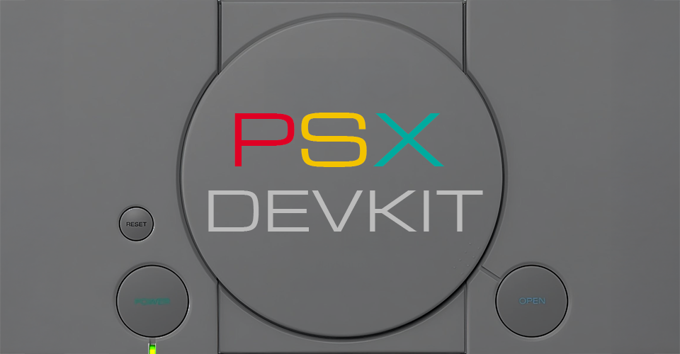
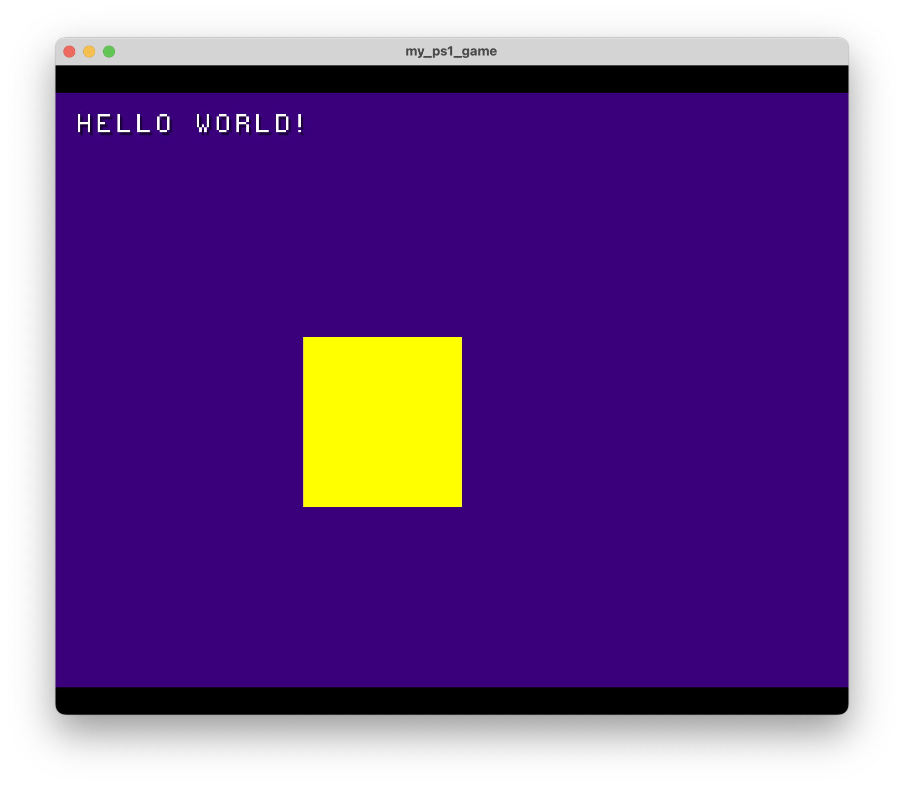
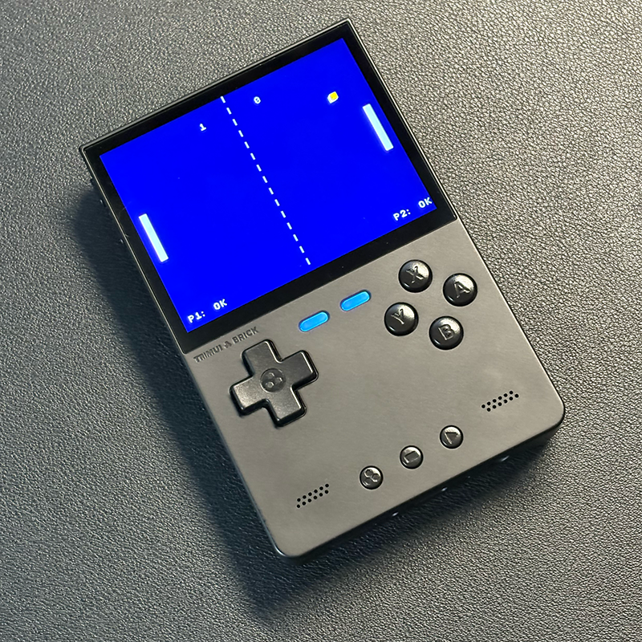

<p align="center">
  
</p>

# PS1 Development Environment
This repository provides a Docker-based development environment for PlayStation 1 (PS1) game development. It includes tools and libraries necessary for building PS1 games, along with a Makefile to streamline the build process.

<p align="center">
  
</p>

<p align="center">
  
</p>


## Dependencies
- Docker
- Make
- PS1 emulator (e.g., DuckStation)

## How to build
To build the project, follow these steps:

1. Clone the repository:
```bash
git clone https://github.com/marconvcm/ps1_dev.git my_game
cd my_game && rm -rf .git && git init
```

2. Build the Docker image:
```bash
make prepare
```

3. Build game:
```bash
make build
```

4. Run the game:
```bash
# Only works if you have DuckStation set up correctly.
DUCKSTATION=/path/to/duckstation make emulate
```

5. Distribute the game:
```bash
make dist
```
It will create a zip file in the `dist` directory containing the game files.


## Contributing
Contributions are welcome! If you have suggestions for improvements or new features, feel free to open an issue or submit a pull request.

## How to run
To run the PS1 game, you can use an emulator like DuckStation. Open cue file in the `out` directory with DuckStation or any other PS1 emulator of your choice.

## License
This project is licensed under the MIT License. See the [LICENSE](LICENSE) file for details